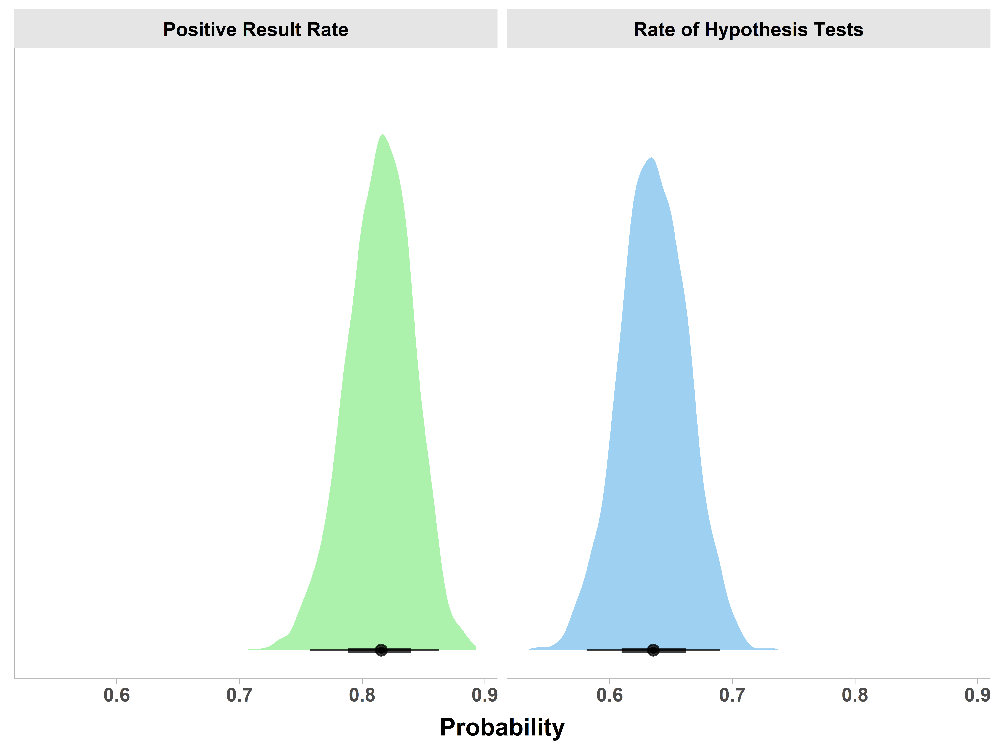

\captionsetup[table]{labelformat=empty}
\captionsetup[figure]{labelformat=empty}
\raggedbottom

```{r setup, include=FALSE}
# To COMPILE RUN THE CODE BELOW
# rmarkdown::render(<your-rmd-file.rmd>, output_format ="all")
library(knitr)
library(tidyverse)
library(kableExtra)
## Global options
#options(max.print="75")
opts_chunk$set(echo=FALSE,
	             cache=TRUE,
               prompt=FALSE,
               tidy=TRUE,
               comment=NA,
               message=FALSE,
               warning=FALSE,fig.pos = "H") #,fig.pos = "H", out.extra = ""
#opts_knit$set(width=75)

source("final_script_run.R")
```

# Introduction

Scientists and knowledge-users who make decisions based on scientific evidence rely on the published literature to be reported transparently and to be an accurate representation of the research that scientists conduct. The ability to replicate scientific findings is vital to establish the credibility of scientific claims and to allow research to progress [@NosekErrington2019]. A large-scale collaborative effort estimated the replicability of findings in psychological science and found that most replication effects are smaller than originally reported @collaboration_estimating_2015. Whilst this is a complex issue, questionable research practices (QRPs) and publication bias explain at least some of the differences between the original and replication effect sizes [@John_Loewenstein_Prelec_2012; @head_extent_2015; @simmons_false-positive_2011]. Alongside psychology @collaboration_estimating_2015, other fields have struggled to replicate or reproduce findings, including neuroscience [@Boekel_Wagenmakers_Belay_Verhagen_Brown_Forstmann_2015; @Turner_Paul_Miller_Barbey_2018; @Kharabian_Genon_2019], cancer biology [@Nosek_Errington_2017], human genetics [@chanock_2007] and pharmacology [@Prinz_Schlange_Asadullah_2011]. This type of systematic replication and evaluation of previously published results has not yet been attempted in kinesiology (alternatively known as sport and exercise science). However, considering the similarities (e.g,. the study of human behaviour) and overlap (e.g. sport and exercise psychology) between psychology and kinesiology, we have reason to believe it may suffer from the same QRPs. Replication appears to be rare in kinesiology, which is perhaps surprising considering that kinesiology has been the focus of significant critique due to overly optimistic inferences [@Sainani_Lohse_Jones_Vickers_2019] and a history of underpowered studies [@Abt_Boreham_Davison_Jackson_Nevill_Wallace_Williams_2020]. Furthermore, a lack of sample size estimation [@Abt_Boreham_Davison_Jackson_Nevill_Wallace_Williams_2020], misuse of p-values and statistical significance testing, limited collaboration with statisticians [@Sainani_2020], minimal or arbitrary use of effect sizes [@Caldwell_Vigotsky_2020], and other reporting issues [@Borg_Lohse_Sainani_2020] appear to be commonplace.

In the past few years, a community of  researchers in kinesiology have been advocating for and adopting open and replicable research practices [@Borg_Bon_Sainani_Baguley_Tierney_Drovandi_2020; @Sainani_2020 @Caldwell_Vigotsky_2020; @Borg_Lohse_Sainani_2020; @caldwell_moving_2020; @Vigotsky_Nuckols_Heathers_Krieger_Schoenfeld_Steele_2020]. Some journals in the field have started to adopt the Registered Report format for manuscripts which is commendable (see \url{www.cos.io/rr for a list of participating journals). However, such practices include openly sharing data and code, pre-registration, and using the registered reports format (for a primer, see @caldwell_moving_2020 for details). Some of the issues that motivated the open science movement in psychology and other fields @munafo_manifesto_2017 are comparatively unexplored in kinesiology, and in addition currently, the number of kinesiology researchers adopting open research practices is largely unknown. There is some indication that both pre-registration and sharing of data is uncommon [@Borg_Lohse_Sainani_2020; @Tamminen_Poucher_2018] and flagship journals of our field (e.g., Medicine \& Science in Sport \& Exercise, European Journal of Sport Science) do not include a statement encouraging data sharing in the author guidelines (Oct 2020). Evaluating a recent sample of the kinesiology literature for such practices may help draw attention to these potential issues.

Another issue that warrants consideration is the positive result rate (the rate at which a published study finds support for its hypothesis) of published kinesiology studies. Recently, @buttner_are_2020 estimated the positive result rate in three high ranking sports journals and one high ranking sports physiotherapy journal. In line with previous research in other scientific disciplines [@fanelli_positive_2010; @scheel_excess_2020], the positive result rate exceeded 80\%. What are the mechanisms for the suspiciously high positive result rates in the scientific literature? Given the assumption of a completely unbiased literature, such a high positive result rate  could only  occur if both statistical power and the proportion of true hypotheses that researchers have chosen to test is consistently high @scheel_excess_2020. The more plausible explanation perhaps, corroborated in previous work [@John_Loewenstein_Prelec_2012; @simmons_false-positive_2011], is that the literature is distorted by undisclosed flexibility in analysis and other QRPs, and the incentive to publish positive results. Registered reports are specifically designed to help mitigate these issues @chambers_registered_2015. Therefore, @scheel_excess_2020 assessed the positive result rate in research articles published using the traditional format in comparison to registered reports in a sample of the psychology literature. The positive result rate was an implausibly high 96\% for traditional articles and a significantly lower 46\% for registered reports. The increased methodological rigour inherent to the registered report format has clearly led to an increase in the reporting of null findings in the psychological literature. 

The equivalent findings regarding standard and registered reports have not been reported for kinesiology, and simply would not be possible given the current literature; unlike psychological science @scheel_excess_2020, and to our knowledge, kinesiology has not accumulated more than 70 RRs to evaluate against traditional publication formats. Nevertheless, the adoption of registered reports in kinesiology is progressing slowly. One reason for this may be a lack of awareness regarding the replication crisis and movement towards more rigorous and transparent research practices. However, the slow adoption of registered reports could also be due to a lack of concern about the kinesiology literature given the limited evidence that a problem exists. Therefore, the primary aim of this study is to assess the positive result rate of reported hypotheses in the recent kinesiology literature, using society-affiliated flagship journals from the field. Considering the majority of scientific disciplines documented by @fanelli_how_2009 had a positive rate of 80\%, we hypothesize that the $>$80\% of the published studies in kinesiology will report positive results (i.e, support for the hypothesis) for their first stated hypothesis. Our secondary aims are to assess a number of related research practices, including whether the kinesiology literature includes replications of previous effects, the detail of statistical reporting and adoption of other transparent reporting practices.
\newpage

# Methods

## Sample
Research articles will be sampled from three flagship kinesiology journals: Medicine and Science in Sport and Exercise (MSSE), the European Journal of Sport Science (EJSS) and the Journal of Science and Medicine in Sport (JSAMS), which represent three major kinesiology societies of North America (American College of Sports Medicine), Europe (European College of Sport Science) and Australia (Sports Medicine Australia), respectively. We selected three major societies and their official flagship journals because we believe they will represent a diverse selection of research in kinesiology and provide insights into the practices of the field as a whole. In addition, we chose to focus on these three journals rather than a random sample of the entire literature because these journals should represent the best research in the field (compared to any published article which could be sampled from a predatory publisher). We plan to select 100 original research articles per journal, 300 in total, excluding study protocols, methodological tutorials/reports, opinions, commentaries, perspectives, conference proceedings, narrative reviews, systematic reviews and meta-analyses. We will also exclude research articles if they have been retracted or contain insufficient information to reach coding decisions. To sample a recent selection of the literature, research articles will be sampled consecutively backwards from December 31, 2019, by the data analyst (ARC). 

## Data Extraction
We have identified nine coders who will be responsible for data extraction. Coders will undergo standardized training that has been designed based on the queries raised and clarification required during pilot testing (see later section). These nine coders will form three teams of three, and each team will be randomly allocated the research articles from one journal (MSSE, EJSS, or JSAMS). All coders will extract data independently and enter this directly into a Qualtrics survey. The Qualtrics survey was refined after pilot testing and a copy is available at \url{https://osf.io/nwcx6/?view_only=a41116388e9244b7821bfb9fe5496bd2} . Each team will be coordinated by a team leader trained at a doctoral level in a kinesiology discipline (RT, VY and JW). Once independent coding is complete, interrater reliability will be assessed using Fleiss’s Kappa, and the number of major disagreements (support vs. no support for the hypothesis) will be reported. Team leaders will be responsible for resolving all conflicts (any instance where there is not agreement between all group members) within their team through group review of the item and group discussion. Where conflicts cannot be resolved (and revised if necessary) using this process, the team leader will consult the other two team leaders. If the other two team leaders do not fully endorse the original team leader’s decision, the majority decision from the original coding will be accepted. All data (original coder responses and summary decisions) will be available after the completion of this study’s Open Science Framework repository. 
 
## Measures and Coding Procedure
All articles will be categorized as basic physiology (animal and cell physiology), applied exercise physiology (human), environmental physiology (heat, cold, and altitude), clinical research, biomechanics, motor learning/control/behaviour, epidemiology, sport/exercise psychology, sport performance, or other (the category that best describes the article). Research articles that do not include explicit statements that a hypothesis was tested will not be included in the analysis of the positive result rate. However, all articles (i.e., 300) will be included in analysis related to replication status, statistical reporting and other reporting practices, as described in the following sections.
 
## Support for a Hypothesis in the Kinesiology Literature
From the 300 articles, we expect that approximately 60\% will include explicit statements that a hypothesis was tested as part of the study (e.g., “We hypothesized that…”) [@buttner_are_2020]. Therefore, we expect to extract data on the positive results rate from approximately 180 research articles. The main dependent variable is whether the first stated hypothesis was supported or not, as reported by the authors. We plan to closely follow the coding procedure used by @fanelli_positive_2010 and @scheel_excess_2020, which is described as follows:
By examining the abstract and/or full text, it will be determined whether the authors of each paper had concluded to have found a positive (full or partial) or negative (null or negative) support. If more than one hypothesis was being tested, only the first one to appear in the text will be considered. The coding of support for the hypothesis will be based on the author's description of their results. In line with previous work [@scheel_excess_2020; @buttner_are_2020], we will also code a hypothesis as having received “support,” “partial support,” “no support” or “unclear or not stated”. We have added this fourth option after pilot indicated that some authors failed to state whether or not the study's hypotheses were, or were not, supported in the discussion section of the manuscript. This will be re-coded into a binary “support” (full or partial) vs. “no support” variable, with "unclear or not stated" removed, for the main analysis. Coding disagreements between full and partial support will be deemed minor since they will not affect the results. Thus, only disagreements affecting the binary support/no support or the unclear classification will be treated as major and resolved through discussion. The language used to state a hypothesis and support for the first tested hypothesis will be included in the data extraction. 

## Replication Status
Coders will assess whether a study is a replication of a previously published one, as reported by the authors. Coders will search the full texts of all papers for the string ‘replic*’ and, for papers that contain it, indicate whether the coded hypothesis was a close replication with the goal to verify a previously published result [@scheel_excess_2020]. Internal replications (replication of a study within the same paper) will not be counted as replications.
 
## Statistical Reporting
Coders will assess whether authors included language related to statistical significance and if p-values were included in the results (relating to all analyses and not only the first hypothesis). If yes, coders will assess if the p-value was interpreted as significant and if the exact or relative p-value was reported (i.e., $p=0.049$ vs. $p<0.05$). If a relative p-value was reported, the level of the reported p-value (e.g., $p<0.05$, $p<0.01$) will be coded. Coders will also extract whether an effect size was reported, including, but not limited to: Cohen's d, correlation coefficients, mean differences, and measures of model fit (e.g., coefficient of determination: $R^2$). Finally, coders will assess whether the information on sample size is provided, and if provided, the total sample size (the number of participants included in the analyses, rather than the planned sample size) will be extracted. Finally, coders will assess whether any sample size justification (e.g. power analysis) was included in the manuscript.
 
## Other Reporting Practices
Coders will assess whether the study is a clinical trial, according to the ICJME definition (\url{https://hub.ucsf.edu/clinicaltrialsgov-definition-clinical-trial}). If yes, coders will assess if a clinical trial registration is reported in the manuscript. For all other types of studies, coders will assess whether studies have been pre-registered (as reported within the manuscript). Coders will assess if a manuscript provides a statement on data availability, and if yes, whether there is open access to the original data and/or code via a link or supplementary file. All additional measures we collect but have not described thus far will either be auxiliary variables to facilitate the coding process or earlier versions of the variables discussed above.
 
## Pilot Testing
To ensure that our questionnaire for our raters accurately and consistently reflects the above-detailed information from relevant articles, we conducted pilot testing before submission of the Stage 1 manuscript. Fifteen original research articles published in 2018, five from each of our three chosen journals, were selected to be used for pilot testing. One team of naive coders (i.e., were not trained prior to coding) extracted all data from these articles and entered this into Qualtrics. Independent coding was checked for disagreements, and this was used to inform training procedures. Pilot aggregated data were generated, and further adjustments were made to refine the planned extraction and analysis process. A summary report of the pilot work can be found at \url{https://osf.io/nwcx6/?view_only=a41116388e9244b7821bfb9fe5496bd2}. Overall, our pilot work indicated minimally acceptable agreement among the raters on the questions essential to our study such as whether a hypothesis was tested ($\kappa$= 0.903; complete agreement = 14/15) and if the authors found support for this hypothesis ($\kappa$= 0.586; complete agreement = 6/9). For all items with rater disagreement, at least two coders were in agreement on the rating. After the conclusion of pilot testing, a forum among the team was completed in order to appropriately adjust the questionnaire and refine future instructions/training for the coding teams in the full study. Prior to coding, all coding team members will undergo formal training and will be presented with example articles (not from the study sample) in order to improve consistency in the coding process.

## Analysis Plan
We plan to estimate the rate at which kinesiology research finds support for the first tested hypothesis (as reported by the authors). Further, we plan to compare this to the majority of disciplines surveyed in @fanelli_positive_2010 which reported a positive result rate in excess of 80\% (16 of 20 disciplines). We find it unlikely that kinesiology would have a positive result rate lower than 80\%, and believe that the actual rate is closer to the social sciences at approximately 85\% [@fanelli_positive_2010]. Considering we have a good prior information, and a belief we want to test, we have opted to use a Bayesian analysis to test our hypothesis. Therefore, we plan to test our hypothesis that the positive result rate is greater than 80\% using a generalized Bayesian regression model [@Burkner_2017]. We assumed a prior of $\beta(17,3)$ on the intercept of the model (i.e., the rate of positive results). Evidence for our hypothesis will be reported as the posterior probability, $pr(Intercept > .8 | data)$, of our hypothesis and Bayes Factor (BF) the ratio of evidence for our hypothesis versus the null. We performed a Monte Carlo simulation assuming we obtained 150 studies which contained hypotheses from a population where 85\% will contain a positive result for the first stated hypothesis. This simulation indicated that our model would have an 87\% chance of being able to obtain some evidence (BF in favor of our hypothesis $>$ 3) for our hypothesis. All other data will be summarized descriptively and as frequencies and proportions. A detailed summary of the planned hypothesis test and “power” analysis can be found at \url{https://osf.io/nwcx6/?view_only=a41116388e9244b7821bfb9fe5496bd2}.

# Results

## Confirmatory Results

```{r fig1, fig.cap="Figure 1. Posterior distributions from Bayesian model with the 50\\% and 95\\% compatibility intervals represented by the error bars at the bottom. ", out.width = "100%"}

```

\newpage

## Exploratory Results

### Statistics Reporting

### Other Important Reporting Practices

### Breakdown by Journal

### Breakdown by Discipline

### Analysis of RCT and Clinical Trials

# Discussion

Lorem ipsum dolor sit amet, consectetuer adipiscing elit. Aenean commodo ligula eget dolor. Aenean massa. Cum sociis natoque penatibus et magnis dis parturient montes, nascetur ridiculus mus. Donec quam felis, ultricies nec, pellentesque eu, pretium quis, sem. Nulla consequat massa quis enim. Donec pede justo, fringilla vel, aliquet nec, vulputate eget, arcu. In enim justo, rhoncus ut, imperdiet a, venenatis vitae, justo. Nullam dictum felis eu pede mollis pretium. Integer tincidunt. Cras dapibus. Vivamus elementum semper nisi. Aenean vulputate eleifend tellus.

Aenean leo ligula, porttitor eu, consequat vitae, eleifend ac, enim. Aliquam lorem ante, dapibus in, viverra quis, feugiat a, tellus. Phasellus viverra nulla ut metus varius laoreet. Quisque rutrum. Aenean imperdiet. Etiam ultricies nisi vel augue. Curabitur ullamcorper ultricies nisi. Nam eget dui. Etiam rhoncus. Maecenas tempus, tellus eget condimentum rhoncus, sem quam semper libero, sit amet adipiscing sem neque sed ipsum. Nam quam nunc, blandit vel, luctus pulvinar, hendrerit id, lorem. Maecenas nec odio et ante tincidunt tempus.

Donec vitae sapien ut libero venenatis faucibus. Nullam quis ante. Etiam sit amet orci eget eros faucibus tincidunt. Duis leo. Sed fringilla mauris sit amet nibh. Donec sodales sagittis magna. Sed consequat, leo eget bibendum sodales, augue velit cursus nunc, quis gravida magna mi a libero. Fusce vulputate eleifend sapien. Vestibulum purus quam, scelerisque ut, mollis sed, nonummy id, metus. Nullam accumsan lorem in dui. Cras ultricies mi eu turpis hendrerit fringilla. Vestibulum ante ipsum primis in faucibus orci luctus et ultrices posuere cubilia Curae; In ac dui quis mi consectetuer lacinia.

Nam pretium turpis et arcu. Duis arcu tortor, suscipit eget, imperdiet nec, imperdiet iaculis, ipsum. Sed aliquam ultrices mauris. Integer ante arcu, accumsan a, consectetuer eget, posuere ut, mauris. Praesent adipiscing. Phasellus ullamcorper ipsum rutrum nunc. Nunc nonummy metus. Vestibulum volutpat pretium libero. Cras id dui. Aenean ut eros et nisl sagittis vestibulum. Nullam nulla eros, ultricies sit amet, nonummy id, imperdiet feugiat, pede. Sed lectus. Donec mollis hendrerit risus. Phasellus nec sem in justo pellentesque facilisis. Etiam imperdiet imperdiet orci. Nunc nec neque. Phasellus leo dolor, tempus non, auctor et, hendrerit quis, nisi. Curabitur ligula sapien, tincidunt non, euismod vitae, posuere imperdiet, leo. Maecenas malesuada. Praesent congue erat at massa. Sed cursus turpis vitae tortor. Donec posuere vulputate arcu. Phasellus accumsan cursus velit. Vestibulum ante ipsum primis in faucibus orci luctus et ultrices posuere cubilia Curae; Sed aliquam, nisi quis porttitor congue, elit erat euismod orci, ac 

## Conclusion

orem ipsum dolor sit amet, consectetuer adipiscing elit. Aenean commodo ligula eget dolor. Aenean massa. Cum sociis natoque penatibus et magnis dis parturient montes, nascetur ridiculus mus. Donec quam felis, ultricies nec, pellentesque eu, pretium quis, sem. Nulla consequat massa quis enim. Donec pede justo, fringilla vel, aliquet nec, vulputate eget, arcu. In enim justo, rhoncus ut, imperdiet a, venenatis vitae, justo. Nullam dictum felis eu pede mollis pretium. Integer tincidunt. Cras dapibus. Vivamus elementum semper nisi. Aenean vulputate eleifend tellus. Aenean leo ligula, porttitor eu, consequat vitae, eleifend ac, enim. Aliquam lorem ante, dapibus in, viverra quis, feugiat a.

\newpage

# Additional Information

## Data Accessibility

The authors agree to share the raw data, digital study materials and analysis code. All study materials can be found on our OSF repository \url{https://osf.io/nwcx6/?view_only=a41116388e9244b7821bfb9fe5496bd2}.

## Author Contributions

- Contributed to conception and design: TBA
- Contributed to acquisition of data: TBA
- Contributed to analysis and interpretation of data: TBA
- Drafted and/or revised the article: TBA
- Approved the submitted version for publication: TBA

## Conflict of Interest

Authors have no conflicts of interest to declare.
  
## Funding

The proposed research is not funded. All necessary support is provided by the authors institutions. This study is an analysis of published research and does not require ethical approval.

## Acknowledgments

We thank everybody.

## Preregistration

Following Stage 1 in-principle acceptance, the authors agreed to pre-registration of the approved protocol on the Open Science Framework. The IPA registration can be found here: \url{https://osf.io/3pqr7}

## Conflicts of Interest

ARC, RT, and VRY currently serve as executive committee members for the Society of Transparency, Openness, and Replication in Kinesiology (STORK).  VRY is a  section editor and ARC is on the Steering Board for Registered Reports in Kinesiology. Neither will be involved in any aspect of handling this manuscript except as authors.  The opinions or assertions contained herein are the private views of the author(s) and are not to be construed as official or reflecting the views of the Army or the Department of Defense. Any citations of commercial organizations and trade names in this report do not constitute an official Department of the Army endorsement of approval of the products or services of these organizations. No authors have any conflicts of interest to disclose. Approved for public release; distribution is unlimited.

\newpage

# References

\parindent0pt 
\setlength{\parskip}{1em}

List of Names