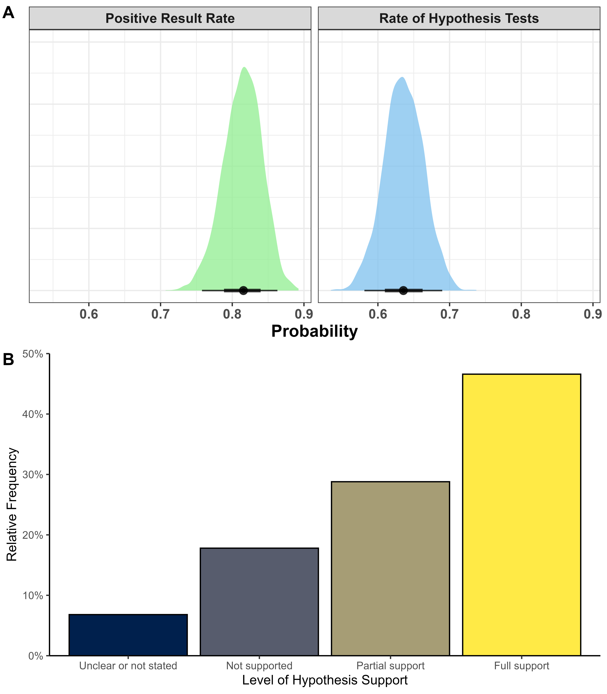

\captionsetup[table]{labelformat=empty}
\captionsetup[figure]{labelformat=empty}
\raggedbottom

```{r setup, include=FALSE}
# To COMPILE RUN THE CODE BELOW
# rmarkdown::render(<your-rmd-file.rmd>, output_format ="all")
library(knitr)
library(tidyverse)
library(kableExtra)
library(scales)
## Global options
#options(max.print="75")
opts_chunk$set(echo=FALSE,
	             cache=FALSE,
               prompt=FALSE,
               tidy=TRUE,
               comment=NA,
               message=FALSE,
               warning=FALSE,fig.pos = "H") #,fig.pos = "H", out.extra = ""
#opts_knit$set(width=75)

source("paper_script.R")
```

# Introduction

Scientists and knowledge-users who make decisions based on scientific evidence rely on the published literature to be reported transparently and to be an accurate representation of the research that scientists conduct. The ability to replicate scientific findings is vital to establish the credibility of scientific claims and to allow research to progress [@NosekErrington2019]. However, a large-scale collaborative effort estimated the replicability of findings in psychological science and found that most replication effects are smaller than originally reported [@collaboration_estimating_2015], suggesting that our positive findings may be over-exaggerated. Whilst this is a complex issue, questionable research practices (QRPs) and publication bias explain some of the differences between the original and replication effect sizes [@John_Loewenstein_Prelec_2012; @head_extent_2015; @simmons_false-positive_2011]. Alongside psychology [@collaboration_estimating_2015], other fields have struggled to replicate or reproduce findings, including neuroscience [@Boekel_Wagenmakers_Belay_Verhagen_Brown_Forstmann_2015; @Turner_Paul_Miller_Barbey_2018; @Kharabian_Genon_2019], cancer biology [@Nosek_Errington_2017], human genetics [@chanock_2007] and pharmacology [@Prinz_Schlange_Asadullah_2011]. This type of systematic replication and evaluation of previously published results has not yet been attempted in kinesiology (alternatively known as sport and exercise science). However, considering the similarities (e.g,. the study of human behaviour) and overlap (e.g. sport and exercise psychology) between psychology and kinesiology, we have reason to believe it may suffer from the same QRPs. Replication appears to be rare in kinesiology, which is perhaps surprising considering that kinesiology has been the focus of significant critique due to overly optimistic inferences [@Sainani_Lohse_Jones_Vickers_2019] and a history of underpowered studies [@Abt_Boreham_Davison_Jackson_Nevill_Wallace_Williams_2020]. Furthermore, a lack of sample size estimation [@Abt_Boreham_Davison_Jackson_Nevill_Wallace_Williams_2020], misuse of p-values and statistical significance testing, limited collaboration with statisticians [@Sainani_2020], minimal or arbitrary use of effect sizes [@Caldwell_Vigotsky_2020], and other reporting issues [@Borg_Lohse_Sainani_2020] appear to be commonplace.

In the past few years, a community of  researchers in kinesiology have been advocating for and adopting open and replicable research practices [@Borg_Bon_Sainani_Baguley_Tierney_Drovandi_2020; @Sainani_2020; @Caldwell_Vigotsky_2020; @Borg_Lohse_Sainani_2020; @caldwell_moving_2020; @Vigotsky_Nuckols_Heathers_Krieger_Schoenfeld_Steele_2020]. Some journals in the field have started to adopt the Registered Report format for manuscripts which is commendable (see www.cos.io/rr for a list of participating journals). However, such practices include openly sharing data and code, pre-registration, and using the registered reports format (for a primer, see @caldwell_moving_2020 for details). However, some of the issues that motivated the open science movement in psychology and other fields @munafo_manifesto_2017 are comparatively unexplored in kinesiology, and currently the number of kinesiology researchers adopting open research practices is largely unknown. There is some indication that both pre-registration and sharing of data is uncommon [@Borg_Lohse_Sainani_2020; @Tamminen_Poucher_2018] and flagship journals of our field (e.g., Medicine \& Science in Sport \& Exercise, European Journal of Sport Science) do not include a statement encouraging data sharing in the author guidelines (Oct 2020). Evaluating a recent sample of the kinesiology literature for such practices may help draw attention to these potential issues.

Another issue that warrants consideration is the positive result rate (the rate at which a published study finds support for its hypothesis) of published kinesiology studies. Recently, @buttner_2020 estimated the positive result rate in three high ranking sports journals and one high ranking sports physiotherapy journal. In line with previous research in other scientific disciplines [@fanelli_positive_2010; @scheel_excess_2020], the positive result rate exceeded 80\%. What are the mechanisms for the suspiciously high positive result rates in the scientific literature? Given the assumption of a completely unbiased literature, such a high positive result rate  could only  occur if both statistical power and the proportion of true hypotheses that researchers have chosen to test is consistently high @scheel_excess_2020. The more plausible explanation perhaps, corroborated in previous work [@John_Loewenstein_Prelec_2012; @simmons_false-positive_2011], is that the literature is distorted by undisclosed flexibility in analysis and other QRPs, and the incentive to publish positive results. Registered reports are specifically designed to help mitigate these issues @chambers_registered_2015. Therefore, @scheel_excess_2020 assessed the positive result rate in research articles published using the traditional format in comparison to registered reports in a sample of the psychology literature. The positive result rate was an implausibly high 96\% for traditional articles and a significantly lower 46\% for registered reports. The increased methodological rigour inherent to the registered report format has clearly led to an increase in the reporting of null findings in the psychological literature. 

The equivalent findings regarding standard and registered reports have not been reported for kinesiology, and simply would not be possible given the current literature; unlike psychological science [@scheel_excess_2020], and to our knowledge, kinesiology has not accumulated more than 70 registered reports to evaluate against traditional publication formats. The adoption of registered reports in kinesiology is progressing slowly. One reason for this may be a lack of awareness regarding the replication crisis and movement towards more rigorous and transparent research practices. However, the slow adoption of registered reports could also be due to a lack of concern about the kinesiology literature given the limited evidence exploring these potential issues in our field. 

The primary aim of this study was to assess the positive result rate of reported hypotheses in the recent kinesiology literature, using society-affiliated flagship journals from the field. Considering the majority of scientific disciplines documented by @fanelli_how_2009 had a positive rate of 80\%, we hypothesized that the $>$ 80\% of the published studies in kinesiology would report positive results (i.e, support for the hypothesis) for their first stated hypothesis. Our secondary aims were to assess a number of related research practices, including whether the kinesiology literature includes replications of previous effects, the detail of statistical reporting and adoption of other transparent reporting practices.

# Methods

## Sample

Research articles were sampled from three flagship kinesiology journals: Medicine and Science in Sport and Exercise (MSSE), the European Journal of Sport Science (EJSS) and the Journal of Science and Medicine in Sport (JSAMS), which represent three major kinesiology societies of North America (American College of Sports Medicine), Europe (European College of Sport Science) and Australia (Sports Medicine Australia), respectively. We selected three major societies and their official flagship journals because we believed they represent a diverse selection of research in kinesiology and provide insights into the practices of the field as a whole. In addition, we chose to focus on these three journals rather than a random sample of the entire literature because these journals should represent the best research in the field (compared to any published article which could be sampled from a possible predatory publisher). We selected 100 original research articles per journal, 300 in total, excluding study protocols, methodological tutorials/reports, opinions, commentaries, perspectives, conference proceedings, narrative reviews, systematic reviews and meta-analyses. We also excluded research articles if they have been retracted or contained insufficient information to reach coding decisions (none were observed in the current study). To sample a recent selection of the literature, research articles were sampled consecutively backwards from December 31, 2019, by the data analyst (ARC) until 100 were included for each journal. 

## Data Extraction

We identified nine coders who were responsible for data extraction. Coders underwent standardized training that has been designed based on the queries raised and clarification required during pilot testing (see later section). These nine coders formed three teams of three, and each team were allocated the research articles from one journal (MSSE, EJSS, or JSAMS). All coders extracted data independently and entered this directly into a Qualtrics survey. The Qualtrics survey was refined after pilot testing and a copy can be found at our Open Science Framework repository (see [Data Accessibility](#data) statement). Each team was coordinated by a team leader trained at a doctoral level in a kinesiology discipline (RT, VY and JW). Once independent coding was complete, interrater reliability was assessed using Fleiss’s Kappa. Team leaders were responsible for resolving all conflicts (any instance where there was not agreement between all group members) within their team through group review of the item and group discussion. Where conflicts could not resolved (and revised if necessary) using this process, the team leader consulted the other two team leaders. All data (original coder responses and summary decisions) is available on study’s Open Science Framework repository (see [Data Accessibility](#data) statement). 
 
## Measures and Coding Procedure

All articles were categorized as basic physiology (animal and cell physiology), applied exercise physiology (human), environmental physiology (heat, cold, and altitude), clinical research, biomechanics, motor learning/control/behavior, epidemiology, sport/exercise psychology, sport performance, or other (the category that best describes the article). Research articles included explicit statements that a hypothesis was tested were included in the analysis of the positive result rate. However, all articles (i.e., 300) were included in analysis related to replication status, statistical reporting and other reporting practices, as described in the following sections.
 
## Support for a Hypothesis in the Kinesiology Literature

From the 300 articles, we expected that approximately 60\% would include explicit statements that a hypothesis was tested as part of the study (e.g., “We hypothesized that…”) [@buttner_2020]. Therefore, we expected to extract data on the positive results rate from approximately 180 research articles. The main dependent variable was whether the *first* stated hypothesis was supported or not, as reported by the authors. We planned to closely follow the coding procedure used by @fanelli_positive_2010 and @scheel_excess_2020, which is described as follows:
By examining the abstract and/or full text, it will be determined whether the authors of each paper had concluded to have found a positive (full or partial) or negative (null or negative) support. If more than one hypothesis was being tested, only the first one to appear in the text was considered. The coding of support for the hypothesis was based on the author's description of their results. In line with previous work [@scheel_excess_2020; @buttner_2020], we coded a hypothesis as having received “support,” “partial support,” “no support” or “unclear or not stated”. We added this fourth option after pilot indicated that some authors failed to state whether or not the study's hypotheses were, or were not, supported in the discussion section of the manuscript. This was re-coded into a binary “support” (full or partial) vs. “no support” variable, with "unclear or not stated" removed, for the main analysis. The language used to state a hypothesis and support for the first tested hypothesis were included in the data extraction and are included in the final dataset. 

## Replication Status

Coders assessed whether a study is a replication of a previously published one, as reported by the authors. Coders searched the full texts of all papers for the string ‘replic*’ and, for papers that contained it, indicated whether the coded hypothesis was a close replication with the goal to verify a previously published result [@scheel_excess_2020]. 
 
## Statistical Reporting

Coders assessed whether authors included language related to statistical significance and if p-values were included in the results (relating to all analyses and not only the first hypothesis). If yes, coders assessed if the p-value was interpreted as significant and if the exact or relative p-value was reported (i.e., $p=0.049$ vs. $p<0.05$). If a relative p-value was reported, the level of the reported p-value (e.g., $p<0.05$, $p<0.01$) were coded. But a "p < 0.001" was considered exact since some statistical software does not provide p-values less than this threshold. Coders also extracted whether an effect size was reported at any stage of the manuscript, including, but not limited to: Cohen's d, correlation coefficients, mean differences, and measures of model fit (e.g., coefficient of determination: $R^2$). Finally, coders assessed whether the information on sample size was provided, and if provided, the total sample size (the number of participants included in the analyses, rather than the planned sample size) will be extracted. Finally, coders assessed whether any sample size justification (e.g. power analysis) were included in the manuscript. 
 
## Other Reporting Practices

Coders assessed whether the study was a clinical trial, according to the ICJME definition (https://hub.ucsf.edu/clinicaltrialsgov-definition-clinical-trial). If yes, coders assessed if a clinical trial registration was reported in the manuscript. For all other types of studies, coders assessed whether studies were pre-registered (as reported within the manuscript). Additionally, the coders indicated if a study was a randomized control trial (RCT) or was a study involving animal models. Coders assessed if a manuscript provided a statement on original data availability (not additional supplementary data), and, if yes, whether there was open access to the original data and/or code via a link or supplementary file.
 
## Pilot Testing

To ensure that our questionnaire for our raters accurately and consistently reflects the above-detailed information from relevant articles, we conducted pilot testing before submission of the Stage 1 manuscript. Fifteen original research articles published in 2018, five from each of our three chosen journals, were selected to be used for pilot testing. One team of naive coders (i.e., were not trained prior to coding) extracted all data from these articles and entered this into Qualtrics. Independent coding was checked for disagreements, and this was used to inform training procedures. Pilot aggregated data were generated, and further adjustments were made to refine the planned extraction and analysis process. A summary report of the pilot work can be found on our [data repository](#data). Overall, our pilot work indicated minimally acceptable agreement among the raters on the questions essential to our study such as whether a hypothesis was tested ($\kappa$= 0.903; complete agreement = 14/15) and if the authors found support for this hypothesis ($\kappa$= 0.586; complete agreement = 6/9). For all items with rater disagreement, at least two coders were in agreement on the rating. After the conclusion of pilot testing, a forum among the team was completed in order to appropriately adjust the questionnaire and refine future instructions/training for the coding teams in the full study. Prior to coding, all coding team members underwent formal training and were presented with example articles (not from the study sample) in order to improve consistency in the coding process.

## Statistical Analysis 

A detailed summary of the planned hypothesis test and “power” analysis can be found at our Open Science Framework [repository](#data). Additional, data related to the inter-rater reliability can be found within the supplemental material.

### Confirmatory Analyses

First, we estimated the rate at which kinesiology research finds support for the first tested hypothesis (as reported by the authors). Further, we planned to compare this to the majority of disciplines surveyed in @fanelli_positive_2010 which reported a positive result rate in excess of 80\% (16 of 20 disciplines). We  believed it unlikely that kinesiology would have a positive result rate lower than 80\%, and believe that the actual rate is closer to the social sciences at approximately 85\% [@fanelli_positive_2010]. Considering we had prior information, and a belief we wanted to test, we opted to use a Bayesian analysis to test our hypothesis. Therefore, we planned to test our hypothesis that the positive result rate is greater than 80\% using a generalized Bayesian regression model [@Burkner_2017]. We assumed a prior of $\beta(17,3)$ on the intercept of the model (i.e., the rate of positive results). Evidence for our hypothesis is reported as the posterior probability, $pr(Intercept > .8 | data)$, of our hypothesis and the Bayes Factor (BF), the ratio of evidence for our hypothesis versus the null. We performed a Monte Carlo simulation assuming we obtained 150 studies which contained hypotheses from a population where 85\% will contain a positive result for the first stated hypothesis. This simulation indicated that our model would have an 87\% chance of being able to obtain some evidence (BF in favor of our hypothesis $>$ 3) for our hypothesis. 

### Exploratory Analyses

Sample sizes were compared between disciplines using a one-way Analysis of Variance (ANOVA). Due to the skew in the reported sample sizes, a natural log transformation was applied to the reported sample size to improve model fit and reduce heteroscedasticity. Partial eta-squared ($\eta^2_{p}$) is reported alongside the F-test for this analysis as a measure of effect size. All other data is summarized descriptively and as frequencies and proportions with Pearson's $\chi^2$ (`chisq.test` in R) and binomial (`binom.test` in R) proportions tests where appropriate. Brackets indicate a 95\% compatibility interval (confidence or posterior for frequentist and Bayesian approaches respectively). For frequentist analyses, we did not set an *a priori* significance cutoff, and applied an "unconditional" analysis of these results [@rafi2020semantic].

# Results

## Confirmatory Results

There was weak support for our hypothesis that manuscripts would find some support for their hypothesis 80\% of the time. There was only a `r round(h_test$hypothesis$Post.Prob,4)*100`\% posterior probability of our hypothesis with it being `r round(h_test$hypothesis$Evid.Ratio,2)` times more likely than the null hypothesis. However, the data did favor our secondary hypothesis that at least 60\% of manuscripts perform hypothesis testing with it being `r round(h_test2$hypothesis$Evid.Ratio,2)` times more likely than the null (Posterior Probability: `r round(h_test2$hypothesis$Post.Prob,4)*100`\%). Overall, we estimate that the positive result is `r round(h_ci[1],4)*100`\% [`r round(h_ci[3],4)*100`, `r round(h_ci[4],4)*100`], and there is a `r round(h_ci2[1],4)*100`\% [`r round(h_ci2[3],4)*100`, `r round(h_ci2[4],4)*100`] rate of hypotheses being tested in manuscripts (Figure 1A). Interestingly, we did find a substantial rate (6.8\%) of manuscripts not reporting whether or not a hypothesis was supported (Figure 1B).

```{r fig1, fig.cap="Figure 1. A) Posterior distributions from Bayesian model with the 50\\% and 95\\% percent compatibility intervals represented by the error bars at the bottom and B) Relative frequencies of the level of support reported for hypotheses.", out.width = "90%"}

# Note add frequencies to captions
```

\newpage

## Exploratory Results

### Statistics Reporting

Nearly all manuscripts, `r sig_pr`, reported some form of significance testing. Even when a hypothesis was not stated or tested, significance testing was utilized in `r sig_pr2` of manuscripts (89 of the 109 manuscripts without a stated hypothesis). Most manuscripts, `r eff_pr`, also reported some form of effect size to accompany the results. In addition, only `r ptype_pr`. Though, `r ptype_pr2`, and therefore changed their reporting method within the paper.

### Other Important Reporting Practices

The rate of study registration/preregistration was poor with `r prereg_pr`. Sample size information was often well reported and `r samp_pr`. However, sample size justification information (e.g., power analysis) only appeared in `r njust_pr` of manuscripts. None of the manuscripts analyzed for this study were considered a replication attempt by the original study authors. Only `r datstat_pr`. Further, a meager `r odat_pr`. 

### Analysis by Journal

We tested for differences in the degree of support for the main hypothesis between the three journals, but no differences were noted, $\chi^2$(`r chisq_support$parameter`) = `r round(chisq_support$statistic,2)`; `r pvalue(chisq_support$p.value, add_p = TRUE)`,  (Figure 2A). All three journals had "Full support" for the stated hypothesis in >45\% of manuscripts. However, there were significant differences, $\chi^2$(`r chisq_jtest$parameter`) = `r round(chisq_jtest$statistic,2)`; `r pvalue(chisq_jtest$p.value, add_p = TRUE)`, in the rate of hypotheses being tested (Figure 2B). The majority of MSSE and EJSS had hypothesis tests (74\% and 71\% respectively), but JSAMS had a much lower rate of hypothesis tests (46\%). An effect size was often reported in manuscripts, but EJSS (90\%) had a much better reporting rate, $\chi^2$(`r chisq_jes$parameter`) = `r round(chisq_jes$statistic,2)`; `r pvalue(chisq_jes$p.value, add_p = TRUE)`, than JSAMS (72\%) or MSSE (76\%; Figure 2C). While sample size justifications were rare (Figure 2D), MSSE (35\%) had a higher rate of reporting a sample size justification, $\chi^2$(`r chisq_jjust$parameter`) = `r round(chisq_jjust$statistic,2)`; `r pvalue(chisq_jjust$p.value, add_p = TRUE)`, compared to EJSS (19\%) or JSAMS (14\%). The rate of reporting significance tests in all journals was high (> 80\%). However, JSAMS (84\%) reported a slightly lower rate of significance tests, $\chi^2$(`r chisq_jsig$parameter`) = `r round(chisq_jsig$statistic,2)`; `r pvalue(chisq_jsig$p.value, add_p = TRUE)`, than EJSS (92\%) or MSSE (94\%).

\newpage

```{r fig2, fig.cap="Figure 2. Relative frequencies, by journal, for A) level of reported support for hypotheses, B) indication of whether a hypothesis was tested, C) indication of whether an effect size was reported, or D) indication of if sample size was justified by the authors. Journals included the European Journal of Sport Science (EJSS), the Journal of Science and Medicine in Sport (JSAMS), and Medicine and Science in Sport and Exercise (MSSE), ", out.width = "90%"}
knitr::include_graphics("figure2.jpg")
```

\newpage

### Analysis by Discipline

When comparing between disciplines, we observed a large variation in the degree of support found for the proposed hypothesis, $\chi^2$(`r chisq_dissupp$parameter`) = `r round(chisq_dissupp$statistic,2)`; `r pvalue(chisq_dissupp$p.value, add_p = TRUE)`. In fact, motor behavior andd environmental physiology studies all found full or partial support within the sample of manuscripts (Figure 3A). Basic physiology was the worst at not reporting whether or not a hypothesis was supported with 37.5\% of the studies never making a clear statement of support (Figure 3A). The rate of hypothesis testing differed greatly between disciplines, $\chi^2$(`r chisq_dishypop$parameter`) = `r round(chisq_dishypop$statistic,2)`; `r pvalue(chisq_dishypop$p.value, add_p = TRUE)` (Figure 3B). The extremes of the spectrum ranged from epidemiology (25.9\%) to basic physiology (88.9\%). Sample size, evaluated using a linear model with a natural log transformation of the total sample size, differed between disciplines, F(9, 285) = 21.81, p = $2.2 \cdot 10^{-16}$, $\eta^2_g$ = 0.408. The estimated average sample size, derived from the estimated marginal mean, per discipline ranged from the lowest in environmental physiology, N = 16 [7, 37], to the highest in epidemiology, N = 1162 [691, 1952] (Figure 2C).

\newpage

```{r fig3, fig.cap="Figure 3. The breakdown, by dispcipline, for A) indication of whether a hypothesis was tested B) level of reported support for hypotheses,  and C) the estimated total sample size (grey bands indicate 95\\% confidence intervals).", out.width = "90%"}
knitr::include_graphics("figure3.jpg")
```

\newpage

### Analysis of RCT and Clinical Trials

Clinical trials (N = 40) had lower rates of reported support for the hypothesis, 64\% [42.5, 82], but similar hypothesis testing rates, 67.5\% [50.8, 81.4], compared to the rest of the analyzed manuscripts. Despite guidelines requiring sample size justifications, only 62.5\% [45.8, 77.3] reported a sample size justification. In addition, despite regulations that require clinical trial registration, only 57.5\% [40.9, 72.9] reported clinical trial registration or preregistration documentation. 

Another category of studies that requires particular reporting are RCTs (N = 64). Overall, the manuscripts including RCTs had similar rates of supporting the hypothesis, 75\% [59.7, 86.8] and a high rate, 73.4\% [60.9, 83.7], of testing hypotheses. Like clinical trials, RCTs often lacked sample size justifications, 50\% [37.2, 62.8], and lacked pre-registrations, 28.1\% [17.6, 40.8].


# Discussion

We performed a systematic evaluation of the 300 journal articles published in the flagship journals of three major sport and exercise science societies. Our primary hypothesis that the proportion of studies finding support for their first hypothesis would be more than 80\% was weakly corroborated. This positive result rate is still excessively high at 81\%, and would likely be much lower if there more stringent criteria for hypothesis tests. Our secondary hypothesis that more than 60\% of articles would explicitly report a hypothesis was corroborated, though our estimate of approximately 64\% is relatively low when considering that >90\% of articles used null hypothesis significance testing. The low proportion of null results, lack of sample size justifications, low numbers of pre-registrations (even in the case of clinical trials), the near absence of open data, and the complete absence of replication studies cast doubt on the credibility of the scientific reporting practices of sport and exercise science. 

The positive result rate observed in this study is very similar to what has been observed in a variety of other fields. In a recent study of sports medicine, @buttner_2020 estimated the positive result at ~82.2\% [@buttner_2020] which is almost indistinguishable from the estimated rate in our study of kinesiology (~81\%; Figure 1A). However, the positive result rates for kinesiology and sports medicine is slightly lower than the overall scientific positive result rate of 84\% that was reported by @fanelli_2010. The positive result rate does appear to vary by field with some fields having positive result rates as low as 70\% (space science) and as high as 90\% (psychology) [@fanelli_2010]. The results from our study and @buttner_2020 would place kinesiology and sports medicine closer to the "hard" sciences than to the "soft" sciences [@fanelli_2020]. The positive result rate in kinesiology is almost certainly lower than psychology which is estimated to report support for hypotheses in ~96\% of manuscripts involving original research [@scheel_excess_2020]. However, the positive result in kinesiology is still unreasonably high, and efforts to reduce the excessively positive spin of hypothesis tests should be undertaken. As @scheel_excess_2020 demonstrated, when researchers adopt a registered report approach the positive result rate drops to 46\%.

In the current study, we observed that ~60\% of manuscripts reported that they were testing hypotheses, and this is almost identical to the rate reported by @buttner_2020. As @fanelli_2010 noted, researchers may selectively report whether or not hypothesis testing was the original goal of a study. Some researchers may have removed language regarding hypothesis testing if their planned hypothesis did not get the support the data they were expecting, or if the results were ambiguous. Approximately 80\% of the studies within our study that did not report a hypothesis utilized significance testing, which is a statistical tool intended for testing hypotheses. Therefore, we believe it is possible that some studies included in our sample may have originally been intended to test hypotheses but the language regarding hypothesis tests was removed during the writing process. If studies and hypotheses were pre-registered, or written as a registered report, then the positive result rate may have been lowered simply due to the fact that language regarding hypothesis tests would still be included within the manuscript.

Assuming no bias in the scientific record, the positive result rate of a sample of articles would depend on the statistical power and  proportion of true hypotheses tested in the included studies [@scheel_excess_2020; @ioannidis_why_2005]. The proportion of true hypotheses being tested may be higher in sport and exercise science because studies can be resource-intensive due to the use of specialist equipment and techniques or the time and personnel required for specific study designs (for example, training studies with multiple laboratory visits). Studies can also be demanding or invasive for participants. Kinesiology researchers may design studies and test trivial hypotheses where a positive result is largely foreseeable (and potentially unimportant) in order to increase the odds of "success" when resources are constrained. Arguably, the most resource-intensive discipline is environmental physiology, and, in our sample, 100\% of studies found some support for their hypothesis. However, we find it unlikely that such a high rate of true hypotheses in literature explains the high positive result rate because this also depends on the vast majority of studies having a high statistical power (~80\%). Considering that sample size justifications of any type (not only a sample size calculation based on the predicted effect size, but also on resource limitations) were included in less than 25\% of articles (and for example, in athletes, researchers are often interested in small effects), it is unlikely that statistical power was sufficiently high to explain the positive result rate. It is implausible given the 100\% positive result rate in environmental physiology articles where the average sample size was lowest (N = 16).  In addition, there have previously been similar concerns with the Journal of Sports Science reporting a median sample size of 19 [@Abt_Boreham_Davison_Jackson_Nevill_Wallace_Williams_2020]. Therefore, rather than a consistently high proportion of true hypotheses being tested and consistently high statistical power, it is more reasonable to suggest that a combination of factors including bias, convenience or limited sampling, and QRPs may explain the excessive positive result rate in the kinesiology literature, and this should be further investigated. 

QRPs can be intentional or unintentional; some researchers may simply lack awareness, and consider QRPs to be a normal part of the research process rather than detrimental practices that inflate the Type 1 error rate and lead to a biased literature. Unconscious biases may cause a tendency for researchers to confirm tested hypotheses (confirmation bias) and can influence participants to meet researcher expectations. Similarly, researchers are not immune to publication bias and may be influenced by the perception or reality that a compelling “story” will be more publishable. Despite worldwide initiatives [@DORA2013], there are also clear academic incentives for arriving at positive results because publication quantity and journal-based metrics can be rated above societal impact in funding, appointment, and promotion decisions, and therefore impact career advancement. registered reports offer one solution because articles are peer-reviewed before data collection, so poorly designed research does not progress to an in-principal acceptance, and the format is designed to prevent several QRPs and a bias (whether from the researchers, reviewer, or editor) towards findings that support the hypothesis. registered reports also prevent the findings from being suppressed by peer reviewers (e.g., in the case that the findings refute previous work) an in-principal acceptance is based on the rationale and methods alone. The effect of registered reports is clear in psychology, where the format moves the positive result rate closer to 50\% and introduces adequately powered studies with null results into the scientific record [@Allen2019]. This data is then available to other researchers rather than in the "file drawer" (an analogy for a researcher's negative results that were either not submitted or not accepted for publication), who may have otherwise wasted valuable resources towards testing a hypothesis that may be false. 

Because only 9\% of the studies were pre-registered and none of our selected journals offer the RR format, it is not possible to know if hypotheses presented as a priori were generated a priori or resulted from undisclosed post hoc hypothesizing (or HARKing; hypothesizing after the results are known). Similarly, it is not possible to know if undisclosed analytic flexibility, and selective outcome reporting, was used to obtain the most favorable results (for example, p<0.05 in the direction of the hypothesis). In other words, the high positive result rate may be due to non-confirmatory research (exploratory or hypothesis-generating research that investigates problems that are not clearly defined) being presented as confirmatory (hypothesis-testing) research and a lack of awareness of the distinction between the two. This is unfortunate because non-confirmatory research is no less essential and lays the necessary groundwork that leads to informative confirmatory tests [@Scheel2020]. Our data indicate that JSAMS may be more accepting of articles that do not explicitly test a hypothesis. However, the more stringent word limit at JSAMS (maximum of 3500 words for original research) may also explain the lower proportion of hypothesis-testing articles (46\%) simply due to authors removing the language regarding hypothesis tests. In contrast, MSSE states that it does not publish preliminary research, demonstrating a clear preference for confirmatory tests.

It is particularly disconcerting that less than two-thirds of clinical trials were not pre-registered, considering that since 2008, the Declaration of Helsinki has stated that every clinical trial must be registered in a publicly accessible database *before* recruitment of the first participant [@KrleaJeri2009]. It is possible that clinical trials involving exercise that comply with international standards are accepted to more rigorous or disease-specific journals. However, recent findings suggest that a lack of pre-registration (and selective outcome reporting) may be an issue with clinical exercise science more broadly [@Singh2021]. Although not extracted, coders also noted that very few (if any) supplementary files included contained completed checklists for the relevant EQUATOR reporting guidelines, and very few (if any) statements were included about the use of reporting guidelines in the articles. No RCTs reporting using CONSORT guidelines, despite JSAMS explicitly including this in author instructions. JSAMS included 2 unregistered clinical trials (7 published clinical trials) despite explicitly including this in author instructions, and MSSE included 10 unregistered clinical trials (25 published clinical trials) despite purporting to adhere to the Declaration of Helsinki. None of the nine animal studies reported using the ARRIVE guidelines, despite MSSE explicitly including this in author instructions. In summary, reporting of kinesiology research in our society journals does not meet international standards for the reporting of health or animal research.

Also disappointing was the lack of dating sharing, with only two articles (<1\%) including a link to the data that support study findings [@Dalecki2019; @Harris2018]. None of the selected journals require authors to provide a data availability statement (though EJSS and JSAMS advise that datasets can be uploaded as a supplement and linked to the article). A data availability statement asks authors to report where data supporting the results reported is available, links to the publicly archived dataset, or conditions under which data can be accessed (e.g., for sensitive clinical data). Open data is part of a broad global open science movement that is advancing science and scientific communication [@Huston2019]. Data and code sharing adds value to the research process by providing verifiable results, and facilitating meta-analysis. Our survey of the literature shows that kinesiology is behind in creating a culture that embraces open research practices. The more encouraging findings are that the majority of studies included an effect size measure, though we used a broad definition of effect sizes, and reporting was not always considered best practice by coders (e.g., only reporting percent changes). Still, ~20\% of studies did not provide any indication of the magnitude of the effect and relied only on p-values, without consideration of the practical or clinical significance of an intervention or experimental manipulation.

Statistical inference in almost all papers relied upon "significance" testing and all papers reported p-values. Even papers that did not include hypothesis tests almost always reported "significant" p-values despite significance testing being a hypothesis testing procedure. The practice of significance testing has been widely criticized by the statistical community [@wasserstein2016asa]. While the authors do not have a problem with using p-values or significance testing per se, it is troubling that these have become a *sine qua non* of publishing in the peer reviewed literature for sport and exercise science. As @gigerenzer2018 eloquently pointed out, when these practices become ingrained, to the point of becoming a requirement for publication, statistical thinking is discarded in favor of statistical rituals. This does necessarily mean the often maligned p-value is to blame, as @mcshane2019abandon noted other statistical hypothesis tests can be misused. Instead, many manuscripts, especially those without hypothesis tests, can adopt a continuous and unconditional interpretation of statistics [@rafi2020semantic]. Studies that are exploratory, or at least not focused on hypothesis tests, should spend more time describing the statistical results within the manuscript and avoid placing emphasis on statistical significance, or at least, make the correct use of p-values in informing their decisions [@Lakens2021pvalue]. Generally, we would recommend that sport and exercise scientists adopt a more diverse set of statistical tools and for journals to encourage manuscript submissions that do not rely only upon significance testing to inform decisions.

## Limitations

We chose to use the flagship scholarly journals run by scientific societies that have the largest memberships worldwide and represent large continental regions (North America, Europe, and Australia). Journal subscription is included with membership with the society, and the official journal of the society is often considered a leading multidisciplinary journal within the field by society members. Our decision was also based on the high proportion of original investigations published in MSSE, EJSS, and JSAMS. MSSE states that "seeks to publish only the very highest quality science". Nevertheless, these journals may not provide a representative sample of the highest quality research in our field and may not have the most progressive editorial policies and reporting standards. Many articles that fall under the broad umbrella of kinesiology are submitted to sub-discipline specific journals (e.g., for sport and exercise physiology or psychology). Assessing the highest-ranked journals may be of interest in future work, though we note that citation data and journal prestige are not necessarily a surrogate of research quality or methodological rigor. Furthermore, our findings are similar to those of @buttner_2020, who found a similar positive result rate of 82.2\% in sports medicine/physical therapy journals, so we doubt that a different selection of journals would alter our conclusions.

A possible limitation is that support for the hypothesis was based on the author's language rather than inspection of the data and statistical analysis by our coders. This was necessary because the latter was not feasible; equivocal hypotheses and limited reporting were common, and different analytic choices influence results [@ManyAnalysts2018]. Although our interest was in the author's interpretation of the data as a reflection of how often authors claim support for the hypotheses in the peer-reviewed literature, the extent to which support for the hypothesis was warranted based on the data and statistical analysis is unknown. Another possible limitation in the hypothesis coding is that the first stated hypothesis may not have always been the primary hypothesis. Finally, there were other considerations to our coding procedures that we list here for transparency: although coders reached agreement on the single category that best described an article, many categorizations required discussion, and often two were suitable; many articles did not include explicit statements of support/no support for the hypothesis, but all coders reached consensus following review and discussion; we coded the number of participants (human or animal), and not the number of observations; although we found no articles that were described as replication studies by the authors, it's possible that some did involve a replication attempt, but were not labelled as such due to the perception or reality that a lack of novelty would preclude publication.

## Conclusion

A moderate proportion (~64%) of scientific articles published by society-led kinesiology journals are confirmatory (hypothesis testing), and the vast majority of these (~81%) report partial or full support for their first hypothesis. Although clearly lower than reported for disciplines with human behavioral experiments (such as psychology), the positive result rate in kinesiology is still questionably high. This cannot convincingly be explained by a consistently high statistical power coupled with an oddly high number of true hypotheses being tested. Instead, the high positive result rate is more likely a reflection of a scientific record that includes many false research findings. Indeed, we found a general lack of transparency, replication, adherence to established reporting standards, and an over reliance on statistical significance testing (even in articles with no stated hypothesis). Therefore, it is more plausible that the high positive result rate is due to a combination of questionable research practices, driven by publication bias and traditional academic incentives. Overall, we conclude that while the positive result rate was lower than expected, other reporting standards must improve within the kinesiology literature. Adoption of improved reporting practices should help increase the credibility of the sport and exercise literature.

\newpage

# Additional Information

## Data Accessibility {#data}

The authors agree to share the raw data, digital study materials and analysis code. All study materials can be found on our Open Science Framework repository: 

https://osf.io/nwcx6/?view_only=a41116388e9244b7821bfb9fe5496bd2

## Author Contributions

- Contributed to conception and design: TBA
- Contributed to acquisition of data: TBA
- Contributed to analysis and interpretation of data: TBA
- Drafted and/or revised the article: TBA
- Approved the submitted version for publication: TBA
  
## Funding

This research was not a funded activity. All necessary support was provided by the author's institutions. This study was an analysis of published research and did not require ethical approval.

## Acknowledgments

We would like to thank John P. Mills for his assistance in setting up our Qualtrics survey for the coding process. We also thank Megan E. Rosa-Caldwell for her assistance in obtaining and organizing the manuscripts from EJSS. We would also like to thank Anne Scheel and Fionn Buttner for their early feedback on this project's design.

## Preregistration

Following Stage 1 in-principle acceptance, the authors agreed to pre-registration of the approved protocol on the Open Science Framework. The IPA registration can be found here: https://osf.io/3pqr7.

## Conflicts of Interest

ARC, RT, and VRY currently serve as executive committee members for the Society of Transparency, Openness, and Replication in Kinesiology (STORK). VRY is a section editor and ARC is on the Steering Board for Registered Reports in Kinesiology. Neither will be involved in any aspect of handling this manuscript except as authors.  The opinions or assertions contained herein are the private views of the author(s) and are not to be construed as official or reflecting the views of the Army or the Department of Defense. Any citations of commercial organizations and trade names in this report do not constitute an official Department of the Army endorsement of approval of the products or services of these organizations. No authors have any conflicts of interest to disclose. Approved for public release; distribution is unlimited.

\newpage

# References

\parindent0pt 
\setlength{\parskip}{1em}
