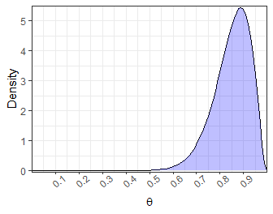
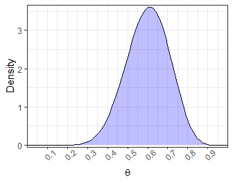

Pilot Analysis Demonstration
================
Aaron R. Caldwell
9/8/2020

# Introduction

In this document I will detail our planned analyses using our pilot data
from 15 manuscripts. Please note that additional analyses may be present
in the final manuscript. All results reported in brackets `[XX, XX]`
represent 95% confidence intervals.

``` r
library(readr)
library(tidyverse)
library(brms)
library(epitab)
df_pilot <- read_csv("df_pilot.csv") %>% 
  mutate_if(is.character,as.factor)
```

# Hypothesis Tests

First, we have two hypotheses included in our manuscript.

1.  For manuscripts with hypotheses, more than 80% will include some
    support for their hypothesis.

<!-- end list -->

  - Prior of \(\beta(17,3)\)

<!-- -->

2.  The proportion of manuscripts that explicitly state they are testing
    hypotheses is greater than 60%.

<!-- end list -->

  - Prior of \(\beta(12,8)\)

<!-- -->

## Rate of Positive Results

From the pilot results, we would conclude that our hypothesis is less
likely than the null hypothesis and therefore the positive result rate
is more likely to be less than 80%

``` r
#Set prior
prior_1 = set_prior("beta(17, 3)", class = "b", lb = 0, ub = 1)

#transform data
hyp_pos = df_pilot %>%
  filter(hypo_tested == "Yes") %>%
  summarize(
    pos = sum(di_sup == "Y"),
    N = length(di_sup),
    rate = pos/N
  )
```

``` r
#Build model
m_test <- brm(
  pos | trials(N) ~ 0 + Intercept,
  family = binomial(link = "identity"),
  prior = prior_1,
  data = hyp_pos,
  refresh = 0
)
```

``` r
h_test <- hypothesis(m_test, "Intercept > 0.8")
knitr::kable(h_test$hypothesis, caption = "Hypothesis Test #1")
```

| Hypothesis             |    Estimate | Est.Error |    CI.Lower |  CI.Upper | Evid.Ratio | Post.Prob | Star |
| :--------------------- | ----------: | --------: | ----------: | --------: | ---------: | --------: | :--- |
| (Intercept)-(0.8) \> 0 | \-0.0347651 | 0.0750573 | \-0.1656635 | 0.0763424 |  0.5631106 |   0.36025 |      |

Hypothesis Test \#1

``` r
test_pos = posterior_interval(m_test,
                   prob = .95)
knitr::kable(test_pos, caption = "Hyp Test #1: 95% Posterior C.I.")
```

|              |        2.5% |       97.5% |
| :----------- | ----------: | ----------: |
| b\_Intercept |   0.5990816 |   0.8935397 |
| lp\_\_       | \-5.5427593 | \-2.9766924 |

Hyp Test \#1: 95% Posterior C.I.

## Rate of Hypotheses Tested

However, we would conclude that there is some weak evidence for our
hypothesis that more than 60% of manuscripts explicitly test a
hypothesis.

``` r
#Set prior
prior_2 = set_prior("beta(12, 8)", class = "b", lb = 0, ub = 1)

#Generate test data
hyp_test = df_pilot %>%
  summarize(
    pos = sum(hypo_tested == "Yes"),
    N = length(hypo_tested),
    rate = pos/N
  )
```

``` r
#Build model
m_test2 <- brm(
  pos | trials(N) ~ 0 + Intercept,
  family = binomial(link = "identity"),
  prior = prior_2,
  data = hyp_test,
  refresh = 0
)
```

``` r
h_test2 <- hypothesis(m_test2, "Intercept > 0.6")
knitr::kable(h_test2$hypothesis, caption = "Hypothesis Test #2")
```

| Hypothesis             |  Estimate | Est.Error |    CI.Lower |  CI.Upper | Evid.Ratio | Post.Prob | Star |
| :--------------------- | --------: | --------: | ----------: | --------: | ---------: | --------: | :--- |
| (Intercept)-(0.6) \> 0 | 0.0310892 | 0.0792066 | \-0.1021272 | 0.1563381 |   1.928258 |    0.6585 |      |

Hypothesis Test \#2

``` r
test_pos2 = posterior_interval(m_test2,
                   prob = .95)
knitr::kable(test_pos2, caption = "Hyp Test #2: 95% Posterior C.I.")
```

|              |        2.5% |       97.5% |
| :----------- | ----------: | ----------: |
| b\_Intercept |   0.4703159 |   0.7747509 |
| lp\_\_       | \-4.1975388 | \-1.7706237 |

Hyp Test \#2: 95% Posterior C.I.

# Descriptive Statistics

For the rest of the paper, since we do not have any explicit hypotheses
we will only use descriptive statistics to how the general rates and
trends of other good, or bad, practices.

## Statistics

There are 3 primary descriptive statistics we are interested in: whether
an effect size was reported, whether or not significance testing was
utilized, and how the authors interpreted the p-values.

``` r
df_pilot %>% 
  filter(hypo_tested == "Yes") %>%
contingency_table(independents=list("Effect Size Reported" = "effect_size",
                                    "Significant p-value" = "pval_sig",
                                    "p-value Type" = "pval_type"),
                  outcomes=list("Significance Testing" = "sig_test"),
                  crosstab_funcs=list(freq())) %>%
  neat_table(format = "latex",
             caption = "Statistics Reported") 
```

``` r
ct_es = table(df_pilot$effect_size)

binom_es = binom.test(ct_es[[2]],sum(ct_es))
es_pr = paste0(round(binom_es$estimate*100,2),"% [",
       round(binom_es$conf.int[1]*100,2),", ", 
       round(binom_es$conf.int[2]*100,2)
       ,"] of manuscripts reported some estimate of effect size.")

ct_sig = table(df_pilot$pval_sig)

binom_sig = binom.test(ct_sig[[2]],sum(ct_sig))
sig_pr = paste0(round(binom_sig$estimate*100,2),"% [",
       round(binom_sig$conf.int[1]*100,2),", ", 
       round(binom_sig$conf.int[2]*100,2)
       ,"] of manuscripts reported a \"significant\" p-value.")

ct_ptype = table(df_pilot$pval_type)

binom_ptype = binom.test(ct_ptype[[2]],sum(ct_ptype))
ptype_pr = paste0(round(binom_ptype$estimate*100,2),"% [",
       round(binom_ptype$conf.int[1]*100,2),", ", 
       round(binom_ptype$conf.int[2]*100,2)
       ,"] of manuscripts reported exact p-values (p = .045) versus relative p-values (p < .05).")
```

60% \[32.29, 83.66\] of manuscripts reported some estimate of effect
size.

66.67% \[29.93, 92.51\] of manuscripts reported a “significant” p-value.

55.56% \[21.2, 86.3\] of manuscripts reported exact p-values (p = .045)
versus relative p-values (p \< .05).

## Preregistration

Recently, there has been an emphasis on trial preregistration. This
should be a requirement for clinical trials and any randomized control
trial (RCT), and is highly encouraged for animal studies. Overall, from
the pilot data, we would conclude that most manuscripts are out of
compliance for clinical trials and no animal studies included
preregistration information

``` r
contingency_table(independents=list("Clinical Trial"="clin_trial",
                                            "RCT"="RCT",
                                            "Animal" = "animal"),
                  outcomes=list("Preregistration"="prereg"),
                  crosstab_funcs=list(freq()),
                  data=df_pilot) %>%
  neat_table(format = "latex",
             caption = "Preregistration Reported") 
```

``` r
ct_prereg = table(df_pilot$prereg)

binom_prereg = binom.test(ct_prereg[[2]],sum(ct_prereg))
prereg_pr = paste0(round(binom_prereg$estimate*100,2),"% [",
       round(binom_prereg$conf.int[1]*100,2),", ", 
       round(binom_prereg$conf.int[2]*100,2)
       ,"] of manuscripts reported preregistration or clinical trial registration information.")
```

6.67% \[0.17, 31.95\] of manuscripts reported preregistration or
clinical trial registration information.

## Sample Size Information

All current guidelines for these three types of studies also require
sample size reporting and encourage sample size justification. In our
pilot sample all of the studies at least included some sample size
information. However, only 2 studies included some form of sample size
justification. Therefore, Kinesiology studies are 6.5 times more likely
to *not* report a sample size justification.

``` r
contingency_table(independents=list("Clinical Trial"="clin_trial",
                                            "RCT"="RCT",
                                            "Animal" = "animal"),
                  outcomes=list("Sample Size Justification"="N_just"),
                  crosstab_funcs=list(freq()),
                  data=df_pilot) %>%
  neat_table(format = "latex",
             caption = "Sample Size Justification")
```

``` r
ct_njust = table(df_pilot$N_just)

binom_njust = binom.test(ct_njust[[2]],sum(ct_njust))
njust_pr = paste0(round(binom_njust$estimate*100,2),"% [",
       round(binom_njust$conf.int[1]*100,2),", ", 
       round(binom_njust$conf.int[2]*100,2)
       ,"] of manuscripts reported some form of sample size justification.")
```

13.33% \[1.66, 40.46\] of manuscripts reported some form of sample size
justification.

Further, we can illustrate the range of sample sizes with a histogram of
the total reported sample size. And compare the sample sizes by
sub-discipline. Due to the skewed distribution, the differences in the
sample sizes for sub-disisplines will be compared with a heteroscedastic
one-way ANOVA for trimmed means (WRS2 `t1way` function). Overall, from
the given data we would conclude that the sample sizes have a large
range, and unsurprisingly epidemiology has the largest sample size.

``` r
df_pilot %>%
  filter(N < 50000) %>%
ggplot(aes(x = N)) +
  geom_histogram() 
```

<!-- -->

``` r
df_pilot %>%
  group_by(sci_cat) %>%
  summarize(median = median(N),
            IQR = IQR(N),
    .groups = 'drop'
  ) %>%
  knitr::kable(caption = "Sample Size by Category")
```

<table>

<caption>

Sample Size by Category

</caption>

<thead>

<tr>

<th style="text-align:left;">

sci\_cat

</th>

<th style="text-align:right;">

median

</th>

<th style="text-align:right;">

IQR

</th>

</tr>

</thead>

<tbody>

<tr>

<td style="text-align:left;">

Applied exercise physiology (human)

</td>

<td style="text-align:right;">

19

</td>

<td style="text-align:right;">

52623.75

</td>

</tr>

<tr>

<td style="text-align:left;">

Biomechanics

</td>

<td style="text-align:right;">

13

</td>

<td style="text-align:right;">

0.00

</td>

</tr>

<tr>

<td style="text-align:left;">

Clinical research

</td>

<td style="text-align:right;">

232

</td>

<td style="text-align:right;">

212.00

</td>

</tr>

<tr>

<td style="text-align:left;">

Environmental physiology (heat, cold, & altitude)

</td>

<td style="text-align:right;">

40

</td>

<td style="text-align:right;">

0.00

</td>

</tr>

<tr>

<td style="text-align:left;">

Epidemiology

</td>

<td style="text-align:right;">

986

</td>

<td style="text-align:right;">

159.00

</td>

</tr>

<tr>

<td style="text-align:left;">

Motor learning/control/behavior

</td>

<td style="text-align:right;">

335

</td>

<td style="text-align:right;">

0.00

</td>

</tr>

<tr>

<td style="text-align:left;">

Sport performance

</td>

<td style="text-align:right;">

32

</td>

<td style="text-align:right;">

15.50

</td>

</tr>

<tr>

<td style="text-align:left;">

Sport/exercise psychology

</td>

<td style="text-align:right;">

197

</td>

<td style="text-align:right;">

0.00

</td>

</tr>

</tbody>

</table>

## Other Open Sciences Practices

We can estimate the proportion of studies that report some type of open
data or data sharing in their manuscript.

``` r
knitr::kable(table(df_pilot$open_data),
             caption = "Data Sharing Reported")
```

<table>

<caption>

Data Sharing Reported

</caption>

<thead>

<tr>

<th style="text-align:left;">

Var1

</th>

<th style="text-align:right;">

Freq

</th>

</tr>

</thead>

<tbody>

<tr>

<td style="text-align:left;">

No

</td>

<td style="text-align:right;">

11

</td>

</tr>

<tr>

<td style="text-align:left;">

Yes

</td>

<td style="text-align:right;">

4

</td>

</tr>

</tbody>

</table>

``` r
ct_odat = table(df_pilot$open_data)

binom_odat = binom.test(ct_odat[[2]],sum(ct_odat))
odat_pr = paste0(round(binom_odat$estimate*100,2),"% [",
       round(binom_odat$conf.int[1]*100,2),", ", 
       round(binom_odat$conf.int[2]*100,2)
       ,"] of manuscripts reported some form of data sharing or open data.")
```

26.67% \[7.79, 55.1\] of manuscripts reported some form of data sharing
or open data.

There is some concern that the replicability of kinesiology is not know
so we can also report the proportion of studies that explicitly stating
they are replicating previous work.

``` r
knitr::kable(table(df_pilot$replic),
             caption = "Replication Studies")
```

<table>

<caption>

Replication Studies

</caption>

<thead>

<tr>

<th style="text-align:left;">

Var1

</th>

<th style="text-align:right;">

Freq

</th>

</tr>

</thead>

<tbody>

<tr>

<td style="text-align:left;">

No

</td>

<td style="text-align:right;">

15

</td>

</tr>

</tbody>

</table>

``` r
ct_replic = table(df_pilot$replic)

binom_replic = binom.test(0,15)
replic_pr = paste0(round(binom_replic$estimate*100,2),"% [",
       round(binom_replic$conf.int[1]*100,2),", ", 
       round(binom_replic$conf.int[2]*100,2)
       ,"] of manuscripts explicitly stated they were replicating a previous study.")
```

0% \[0, 21.8\] of manuscripts explicitly stated they were replicating a
previous study.
